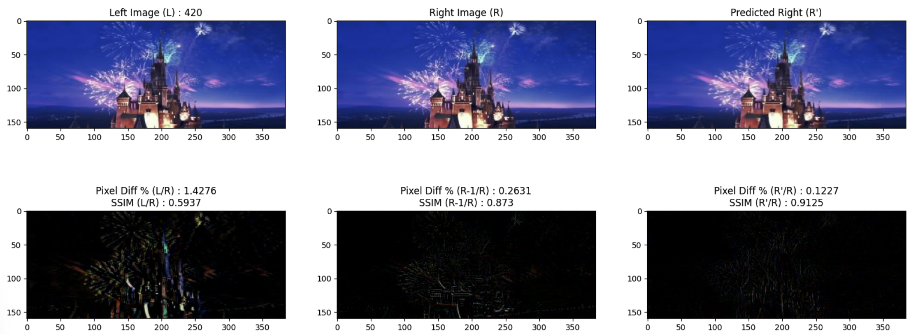
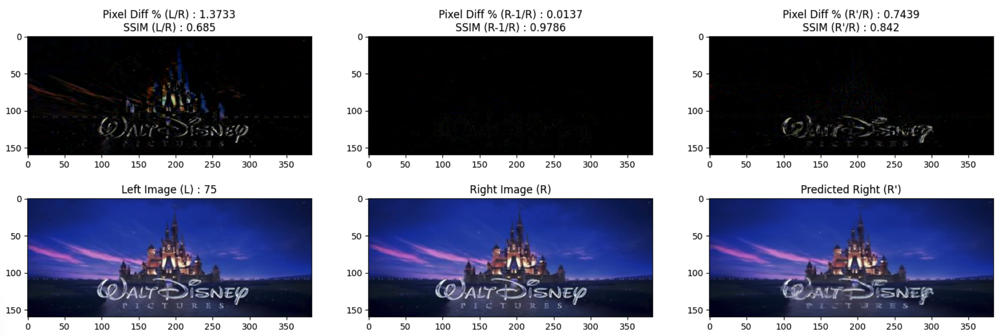
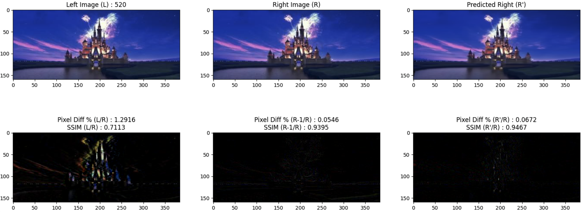

# Deep3D-pytorch : A Baseline Implementation of paper in PyTorch

Stereoscopic frames are two separate images of the same scene or object, taken from slightly different angles. The images are viewed through a stereoscope or other device that presents the left image to the left eye and the right image to the right eye. The brain combines the two images to create a single image with depth and dimension.

This repository contains a PyTorch implementation of the [Deep 3D paper](https://arxiv.org/abs/1604.03650), a popular method for monocular-to-stereo image conversion. The paper introduces a novel approach for generating depth information from single images to create stereo pairs, leveraging deep learning techniques.

The main model is in `Deep3D_model.py`.

## Purpose of This Implementation

- **Baseline Measurement**: The primary objective of this implementation is to see whether in a stereoscopic video, can we R-1 frame with L frame to generate the R (test) frame to improve performance.
- **Output Analysis**: Assess the quality, performance, and feasibility of this approach for high-resolution images.

## Features

- All you a need is a video to start. Contains ffmpeg modules to generate L and R frames from video.
- Complete reproduction of the Deep 3D methodology in PyTorch.
- Additionally focused on adapting the model to support high-resolution input frames.
- Includes preprocessing, training, and inference scripts for testing on custom datasets.

## Results

The figures below provide an analysis of the performance of the Deep 3D model in generating a predicted right view (R') from a left image (L) as compared to the ground truth right image (R).

_Pixel Diff %_: Measures the average pixel intensity difference as a percentage. A lower value indicates higher similarity.

_SSIM (Structural Similarity Index Measure)_: Quantifies perceptual similarity, considering luminance, contrast, and structure. A higher value (closer to 1) indicates greater structural similarity.

## References

1. Xie, J., Girshick, R., Farhadi, A. (2016). [Deep3D: Fully Automatic 2D-to-3D Video Conversion with Deep Convolutional Neural Networks](https://arxiv.org/abs/1604.03650). _arXiv preprint arXiv:1604.03650_.

2. Official PyTorch Documentation: [https://pytorch.org/docs/](https://pytorch.org/docs/)

3. Structural Similarity Index Measure (SSIM): [SSIM Paper](https://www.cns.nyu.edu/pub/eero/wang03-reprint.pdf)

   - Wang, Z., Bovik, A. C., Sheikh, H. R., & Simoncelli, E. P. (2004). Image quality assessment: From error visibility to structural similarity. _IEEE Transactions on Image Processing_, 13(4), 600-612.

4. Image Processing and Computer Vision Techniques: Gonzalez, R. C., & Woods, R. E. (2007). _Digital Image Processing_ (3rd Edition). Pearson.
